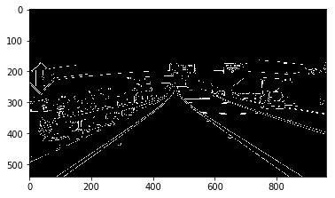

# Hough transform


```python
%matplotlib inline
!pip install opencv-python
import matplotlib.pyplot as plt
import matplotlib.image as mpimg
import numpy as np
import cv2
```

    Requirement already satisfied: opencv-python in /opt/conda/lib/python3.6/site-packages
    Requirement already satisfied: numpy>=1.11.3 in /opt/conda/lib/python3.6/site-packages (from opencv-python)
    You are using pip version 9.0.3, however version 18.0 is available.
    You should consider upgrading via the 'pip install --upgrade pip' command.


```python
# Read in and grayscale the image
image = mpimg.imread('exit-ramp.jpg')
gray = cv2.cvtColor(image,cv2.COLOR_RGB2GRAY)
plt.imshow(gray, cmap='Greys_r')
```


    <matplotlib.image.AxesImage at 0x7f5598652240>


```python
# Define a kernel size and apply Gaussian smoothing
kernel_size = 3
blur_gray = cv2.GaussianBlur(gray,(kernel_size, kernel_size),0)
plt.imshow(blur_gray, cmap='Greys_r')
```


    <matplotlib.image.AxesImage at 0x7f5562d424e0>


```python
# Define our parameters for Canny and apply
low_threshold = 125
high_threshold = 175
edges = cv2.Canny(blur_gray, low_threshold, high_threshold)
plt.imshow(edges, cmap='Greys_r')
```


    <matplotlib.image.AxesImage at 0x7f5562c99780>





```python
# Next we'll create a masked edges image using cv2.fillPoly()
mask = np.zeros_like(edges)   
ignore_mask_color = 255   

# This time we are defining a four sided polygon to mask
imshape = image.shape
vertices = np.array([[(0,imshape[0]),(450, 290), (490, 290), (imshape[1],imshape[0])]], dtype=np.int32)
cv2.fillPoly(mask, vertices, ignore_mask_color)
masked_edges = cv2.bitwise_and(edges, mask)
plt.imshow(masked_edges, cmap='Greys_r')
```


    <matplotlib.image.AxesImage at 0x7f5562c7c048>


```python
# Define the Hough transform parameters
# Make a blank the same size as our image to draw on
rho = 2                          # distance resolution in pixels of the Hough grid
theta = np.pi/180                # angular resolution in radians of the Hough grid
threshold = 50                   # minimum number of votes (intersections in Hough grid cell)
min_line_length = 40             # minimum number of pixels making up a line
max_line_gap = 15                # maximum gap in pixels between connectable line segments
line_image = np.copy(image) * 0  # creating a blank to draw lines on

# Run Hough on edge detected image
# Output "lines" is an array containing endpoints of detected line segments
lines = cv2.HoughLinesP(masked_edges, rho, theta, threshold, np.array([]), min_line_length, max_line_gap)
# Iterate over the output "lines" and draw lines on a blank image
for line in lines:
    for x1,y1,x2,y2 in line:
        cv2.line(line_image,(x1,y1),(x2,y2), (255,0,0), 10)

# Create a "color" binary image to combine with line image
color_edges = np.dstack((edges, edges, edges)) 

# Draw the lines on the edge image
lines_edges = cv2.addWeighted(color_edges, 0.8, line_image, 1, 0) 
plt.imshow(lines_edges)
```


    <matplotlib.image.AxesImage at 0x7f5562bd7198>


